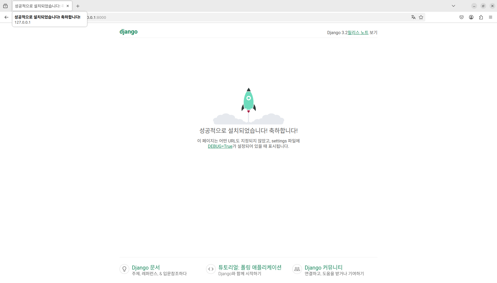

# SP2025S: 2025-1 서버프로그래밍(가)반 팀 프로젝트
## 프로젝트 요약
### 프로젝트 주제
- 팀플 도움 웹 서비스
### 기여자
- jeeen0(WEB FE)
- heemings(WEB BE)
- shagyeong(DB)
### 기술 스택
- WEB FE: HTML, CSS, JavaScript
- WEB BE: Django
- DB: MySQL

## 테스트
### 웹
- 서버 구동
    ```
    $ python3 manage.py runserver
    Watching for file changes with StatReloader
    Performing system checks...

    System check identified no issues (0 silenced).
    March 20, 2025 - 20:25:58
    Django version 3.2.12, using settings 'serverproject.settings'
    Starting development server at http://127.0.0.1:8000/
    Quit the server with CONTROL-C.
    ```
- http://127.0.0.1:8000/
    - 
### 데이터베이스
- 데이터베이스 임포트
    ```
    $ mysql -u [root] -p
    Enter password:
    mysql> source ./SP2025S.sql;
    mysql> show databases;
    +--------------------+
    | Database           |
    +--------------------+
    | SP2025S            |
    +--------------------+
    1 rows in set (0.00 sec)
    mysql> show tables;
    +-------------------+
    | Tables_in_SP2025S |
    +-------------------+
    | attendance        |
    | dept              |
    | instructor        |
    | section           |
    | student           |
    | team              |
    +-------------------+
    6 rows in set (0.01 sec)
    ```
- 학생 테이블 조회
    ```
    mysql> select * from student;
    +------------+---------+------+
    | student_id | dept_id | name |
    +------------+---------+------+
    | 21-001     | AIC     | Kim  |
    | 21-002     | AIC     | Kim  |
    | 21-003     | AIC     | Lee  |
    | 21-004     | AIC     | Shin |
    | 21-005     | AIC     | Park |
    | 21-006     | AIC     | Kim  |
    | 21-201     | EEE     | Lee  |
    | 21-301     | GME     | Lee  |
    | 22-001     | AIC     | Park |
    | 22-002     | AIC     | Kim  |
    | 22-003     | AIC     | Choi |
    | 23-001     | AIC     | Kim  |
    | 23-002     | AIC     | Lee  |
    | 23-003     | AIC     | Son  |
    | 23-004     | AIC     | Kim  |
    | 23-005     | AIC     | Han  |
    | 23-006     | AIC     | Seo  |
    | 23-007     | AIC     | Kim  |
    | 23-301     | GME     | Jeon |
    | 24-001     | AIC     | Lee  |
    +------------+---------+------+
    20 rows in set (0.00 sec)
    ```
- MySQL 종료
    ```
    mysql> quit
    Bye
    $
    ```
- test: 팀장으로 지정된 학생 조회  
    
